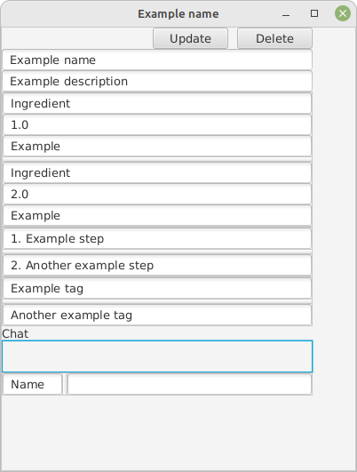

# Recipe app

## Description

This is a recipe app that allows users to save recipes. The recipes can be filtered by tags and each recipe has a chat section so that users can discuss recipes and ask questions.
It uses the following technologies:
* Java
* JavaFX
* Spring Boot
* Kafka
* Websockets
* SQL

## Table of Contents

- [Installation](#installation)
- [Usage](#usage)
- [Credits](#credits)
- [Dependencies](#dependencies)
- [Tests](#tests)

## Installation

To install this project, follow these steps:
1. **Pre-requisites:**
    * Java 17
    * MySQL / MariaDB
    * Kafka
2. **Installing kafka**
   * Download kafka from [here](https://kafka.apache.org/downloads) (binary downloads, Scala version doesn't matter for this project)
   * Extract the downloaded file
   * Open a terminal in the extracted folder
   * Linux / Mac: Start zookeeper: `bin/zookeeper-server-start.sh config/zookeeper.properties`
   * Windows: Start zookeeper: `bin\windows\zookeeper-server-start.bat config\zookeeper.properties`
   * Linux / Mac: Start kafka: `bin/kafka-server-start.sh config/server.properties`
   * Windows: Start kafka: `bin\windows\kafka-server-start.bat config\server.properties`
   1. **Extra notes on Kafka:**
      * The application will create the topics automatically and use the settings in your kafka config/server.properties file
      * For better scalability and performance, you can create multiple partitions for the topics. This can be done by modifying/adding the following lines to your config/server.properties file:
      * `num.partitions=N` where N is the number of partitions you want to create (default is 1, recommended is 3 or more)
      * You could also run multiple kafka brokers for better redundancy, either on multiple servers or on the same machine by copying the server.properties file and modifying the following lines in your file:
      * `broker.id=N` where N is the broker id, each broker must have a unique id
      * `listeners=PLAINTEXT://:9092` where 9092 is the port number, each broker must have a unique port number
      * `log.dirs=/tmp/kafka-logs-N` where N is the broker id, each broker must have a unique log directory
      * If you do run multiple brokers you must also add them to the application.properties file in both recipe-backend and recipe-frontend in the spring.kafka.bootstrap-servers property, for example: `spring.kafka.bootstrap-servers=localhost:9092,localhost:9093,localhost:9094`
      * If you want example of configuration files, look [here](kafka-config-example) for three server properties files that can be run simultaneously on the same machine. These will create a standard of three partitions per topic.
3. **Installing MySQL / MariaDB**
   * MariaDB is fully open source and can be downloaded from [here](https://mariadb.org/download/)
   * MySQL has open source community edition and can be downloaded from [here](https://www.mysql.com/downloads/)
   * Install the database and create a database called `recipe`
   * Add a user, for example `mysql` with password `password` and grant all privileges on the `recipe` database to the user
   * If you want to use a different user or password, you can change the settings in the application.properties file recipe-backend/resources/
   * If you host the database on a different machine, you can change the settings in the application.properties file recipe-backend/resources/
4. **Installing / running the app**
   * Clone the repository
   * Make sure you have Java 17 installed
   * Make sure you have made the changes to the application.properties file as described in the previous steps
   * Make sure your database (MySQL / MariaDB) is running
   * Make sure kafka is running (see previous steps)
   * By default, the application runs with create-drop, which means that the database will be dropped and recreated every time the application is started, this is good for testing purposes because you won't have old data lying about. If you want to keep the data in the database, you can change the settings in the application.properties file recipe-backend/resources/
   1. **Running the app from an IntelliJ**
      * Open the project in IntelliJ
      * Run the recipe-backend application, RecipeBackendApplication.java
      * Run the recipe-frontend application, RecipeFrontendApplication.java
   2. **Running the app from a terminal**
      * Open a terminal in the recipe-backend folder
        * Linux/Mac: Make sure you have the execute permission on the mvnw file: `chmod +x mvnw`
        * Run `./mvnw spring-boot:run`
        * Windows: Run `.\mvnww.cmd spring-boot:run`
      * Open a new terminal or tab in the recipe-frontend folder
        * Linux/Mac: Make sure you have the execute permission on the mvnw file: `chmod +x mvnw`
        * Run `./mvnw spring-boot:run`
        * Windows: Run `.\mvnww.cmd spring-boot:run`

## Usage

1. In the recipe-frontend application use the Send-tab to save a recipe in the database

2. In the recipe-frontend application use the Get-tab to see the saved recipes, update all recipes by clicking `Refresh`, you can filter recipes by tags at the top of the window.

3. Click on View recipe to see the recipe details and chat with other users about the recipe. You can also update or delete the recipe from here.

## Credits
* On-site gang, code / life discussions and feedback:
  * [Ellen](https://github.com/EllenHalv)
  * [Emil](https://github.com/Emilsivertsson)
  * [Johan](https://github.com/JohRome)
  * [Kristian](https://github.com/Bremmster)
  * [Wakana](https://github.com/83wakasug)
  * [Cristoffer](https://github.com/Cristoffer85)
* [Diff blue](https://www.diffblue.com/) for initial test code
* [ChatGPT](https://chat.openai.com/) for bug hunting and code feedback

## Dependencies
See the [main pom.xml](pom.xml), [recipe-backend pom.xml](recipe-backend/pom.xml) and [recipe-frontend pom.xml](recipe-frontend/pom.xml) files for dependencies

## Tests

The tests can be found in the recipe-backend/src/test/java/org/koffa/recipebackend/ folder

[Test report](htmlReport/index.html)

## Discussion
See [DOKUMENATION.md](DOKUMENATION.md) for a discussion about the project (in Swedish)

 
